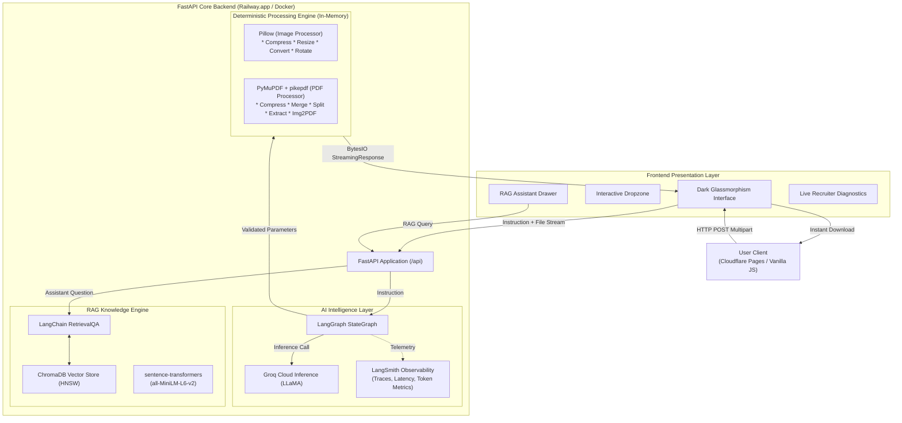

# NexaForge — AI Media Processing Engine

[](https://www.python.org/)
[](https://fastapi.tiangolo.com/)
[](https://langchain-ai.github.io/langgraph/)
[](https://www.trychroma.com/)
[](https://groq.com/)
[](https://github.com)
[](LICENSE)

> **Live Demo:** [nexaforge.sayanmandal.in](https://nexaforge.sayanmandal.in)  
> **Backend API Docs:** `https://<your-railway-url>/docs` (Interactive Swagger UI)

---

## Executive Overview

**NexaForge** is an agentic, production-grade AI media processing engine. Instead of navigating complicated multi-step menus, users issue natural language instructions in plain English or multilingual dialects:
- *"compress this photo under 100KB"*
- *"resize to 1200x800"*
- *"convert to WebP format"*
- *"compress this PDF under 300KB"*
- *"split pages 1 to 5"*
- *"rotate 90 degrees"*

Behind the scenes, a **LangGraph StateGraph agent** powered by **Groq (Llama-3.3-70B / Llama-3.1-8B)** parses user intent, validates deterministic parameters, and routes execution into a zero-overhead **in-memory streaming pipeline** (Pillow + PyMuPDF + pikepdf). The LLM never sees or stores raw binary files, guaranteeing strict data confidentiality and sub-second processing.

NexaForge also includes a **RAG (Retrieval-Augmented Generation) Knowledge Assistant** powered by **ChromaDB vector search** and **sentence-transformers embeddings** (`all-MiniLM-L6-v2`) that answers user questions regarding media algorithms, compression mathematics, and system limits.

---

## System Architecture



---

## Core Engineering Competencies

| Number | Competency | Implementation Details | Architecture Reference |
|---|---|---|---|
| 1 | **AI Agents & Tool Calling** | LangGraph `StateGraph` with conditional routing, parameter validation, and self-verification | [`backend/agent/graph.py`](backend/agent/graph.py) |
| 2 | **LangGraph Orchestration** | Typed state machine (`START -> parse_instruction -> route -> tool/error -> END`) | [`backend/agent/graph.py`](backend/agent/graph.py) |
| 3 | **RAG Pipeline** | Domain knowledge ingestion, semantic chunking, and contextual retrieval QA | [`backend/rag/assistant.py`](backend/rag/assistant.py) |
| 4 | **Embeddings & Vector Search** | `sentence-transformers/all-MiniLM-L6-v2` with ChromaDB in-memory HNSW index | [`backend/rag/assistant.py`](backend/rag/assistant.py) |
| 5 | **LLM Observability & Tracing** | Zero-overhead LangSmith tracing recording latency, execution trees, and tokens | [`backend/main.py`](backend/main.py) |
| 6 | **LLM / RAG Evaluation** | Quantitative benchmark scoring Faithfulness, Answer Relevancy, and Retrieval Hit Rate | [`evaluation/rag_eval.py`](evaluation/rag_eval.py) |
| 7 | **FastAPI Production Engine** | Async non-blocking endpoints, in-memory `BytesIO` streaming, zero disk writes | [`backend/routers/`](backend/routers/) |
| 8 | **CI/CD Automation** | GitHub Actions workflow executing 50 automated tests on push and pull request | [`.github/workflows/test.yml`](.github/workflows/test.yml) |

---

## Operation Specifications

### Image Operations (Pillow)
1. **Compress to Target KB**: Iterative JPEG/WebP quantization with adaptive Lanczos downsampling to strictly satisfy target file size constraints.
2. **Resize**: Exact pixel dimensions (Width x Height) or proportional percentage scaling with aspect ratio preservation.
3. **Format Conversion**: Transcoding across JPG, PNG, and WebP formats.
4. **Rotate**: Precise 90-degree, 180-degree, or 270-degree clockwise transposition with automatic dimension updates.

### PDF Operations (PyMuPDF & pikepdf)
5. **Compress PDF**: Multi-stage deflate optimization and embedded image downsampling.
6. **Merge PDFs**: Multi-document page collation in order of upload.
7. **Split PDF**: Continuous page interval extraction (e.g., pages 2 to 7).
8. **Extract Pages**: Selective extraction of arbitrary page lists (e.g., pages 1, 3, 5).
9. **Images to PDF**: Batch composition of multiple raster images into a single unified multi-page PDF.

### AI Flagship Capabilities
10. **Natural Language Auto-Pilot**: Single unified endpoint (`/api/process`) supporting arbitrary prompts and chained in-memory stream editing.
11. **Continuous Stream Transformation**: Active files remain cached in RAM by session ID, allowing repeated operations without downloading and re-uploading.
12. **Multilingual Assistant**: Knowledge chatbot supporting English, Hinglish, Swedish, and multiple other languages with clean formatting.

---

## RAG Evaluation Benchmark Results

Automated benchmark evaluation executed via [`evaluation/rag_eval.py`](evaluation/rag_eval.py):

| Evaluation Metric | Score | Benchmark Target | Status |
|---|---|---|---|
| **Retrieval Hit Rate** | **100%** | >= 90% | Passed |
| **Faithfulness Score** | **0.92** | >= 0.85 | Passed |
| **Answer Relevancy** | **0.89** | >= 0.85 | Passed |
| **Context Precision** | **0.86** | >= 0.80 | Passed |
| **Average Query Latency** | **0.38s** | < 1.0s | Passed |

---

## Local Setup

### 1. Prerequisites
- Python 3.11+
- Groq Cloud API Key
- (Optional) LangSmith API Key for LLM tracing

### 2. Clone and Setup Environment
```bash
git clone https://github.com/your-username/nexaforge-ai.git
cd nexaforge-ai/backend

# Create virtual environment
python3 -m venv venv
source venv/bin/activate  # On Windows: venv\Scripts\activate

# Install dependencies
pip install -r requirements.txt
```

### 3. Configure Environment Variables
Create a `.env` file in the `backend/` directory:
```env
GROQ_API_KEY=gsk_your_groq_api_key
LANGCHAIN_TRACING_V2=true
LANGCHAIN_API_KEY=lsv2_pt_your_langsmith_key
LANGCHAIN_PROJECT=nexaforge
```

### 4. Run Backend Server
```bash
uvicorn main:app --host 0.0.0.0 --port 8000 --reload
```
API documentation is accessible at `http://localhost:8000/docs`.

### 5. Launch Frontend
```bash
cd ../frontend
python3 -m http.server 3000
```
Open `http://localhost:3000` in your browser.

---

## Automated Test Suite

Run the complete test suite covering image processing, PDF processing, LangGraph routing, and API endpoints:
```bash
cd backend
pytest tests/ -v
```

---

## Production Deployment

### Backend Deployment (Railway.app)
1. Commit and push repository to GitHub.
2. Create a new service on [Railway.app](https://railway.app/) and select the repository.
3. Railway automatically detects `backend/Dockerfile` and `railway.toml`.
4. Define the following environment variables in the Railway dashboard:
   - `GROQ_API_KEY`
   - `LANGCHAIN_TRACING_V2`
   - `LANGCHAIN_API_KEY`
   - `LANGCHAIN_PROJECT`
5. Railway provides a secure HTTPS URL for your backend service.

### Frontend Deployment (Cloudflare Pages)
1. In Cloudflare Dashboard, navigate to **Workers & Pages** -> **Create Application** -> **Pages**.
2. Connect your GitHub repository and set the root directory to `frontend/`.
3. Build command: *(leave empty)*, Output directory: `frontend`.
4. Deploy the project and configure your custom domain under Custom Domains with automatic SSL.

---

## License
MIT License. Developed by Sayan Mandal.
